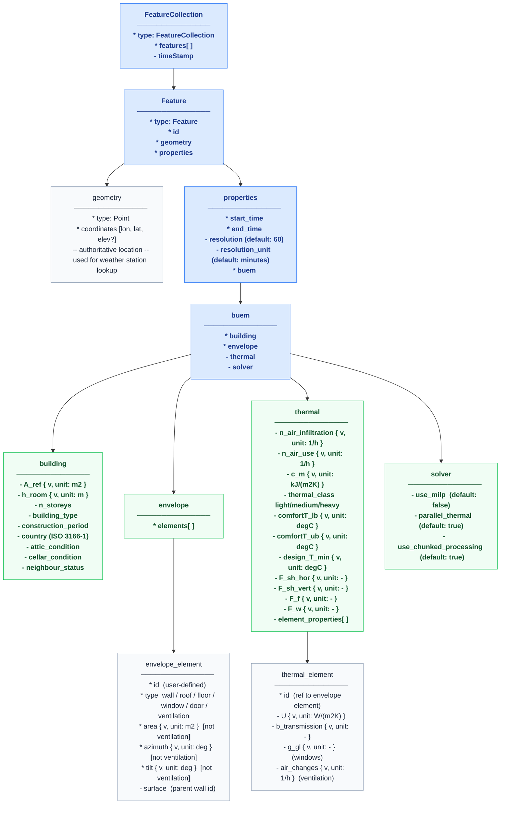
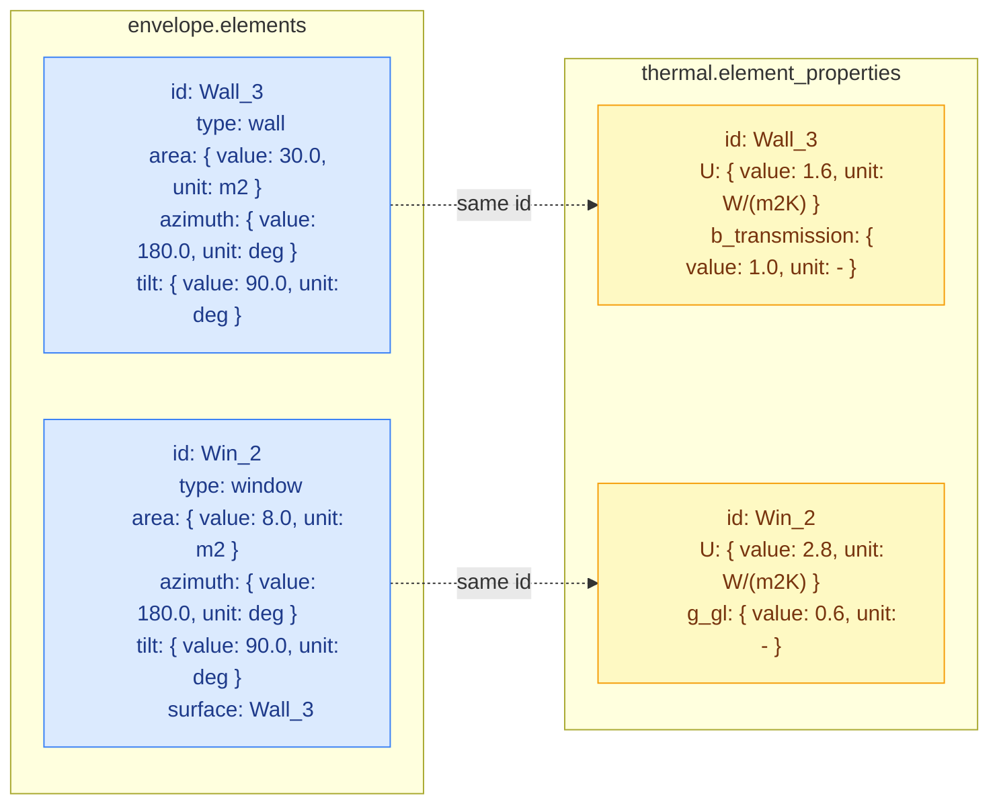
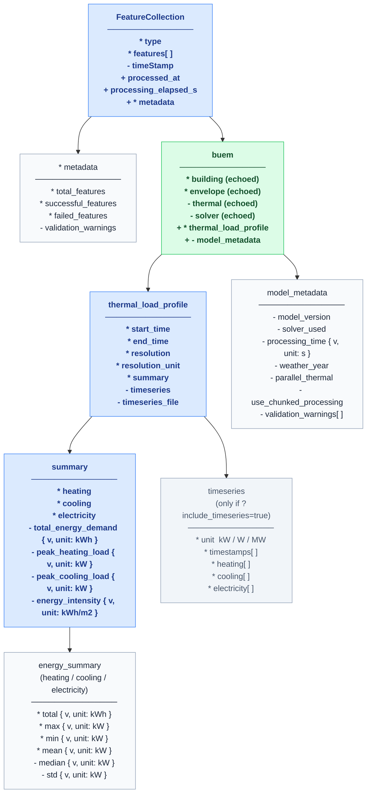

# BUEM API Schema Overview — v3

Visual reference for the v3 request and response schemas.

**Legend**
- `*` = required field
- `-` = optional field
- `{ v, u }` = measurement quantity: `{ "value": number, "unit": string }`

---

## Request Schema

> `geometry.coordinates` is the single source of truth for location — used for weather station lookup. Latitude and longitude are not duplicated inside `buem`.

---

## Envelope / Thermal Split

Geometry and thermal performance are separated and linked by element `id`. Any number of elements per type is allowed.

---

## Response Schema

The response echoes all four `buem` request nodes and appends `thermal_load_profile` and `model_metadata`.

---

## Measurement Type Library

All measurable quantities use `{ "value": number, "unit": string }`. The `unit` field defaults to SI when omitted.

### Request quantities

| $defs key | Allowed units | SI default |
|---|---|---|
| `area_qty` | `m2`, `ft2` | `m2` |
| `length_qty` | `m`, `ft` | `m` |
| `angle_qty` | `deg`, `rad` | `deg` |
| `u_value_qty` | `W/(m2K)`, `BTU/(h.ft2.F)` | `W/(m2K)` |
| `air_change_qty` | `1/h` | `1/h` |
| `heat_capacity_qty` | `kJ/(m2K)`, `BTU/(ft2.F)` | `kJ/(m2K)` |
| `temperature_qty` | `degC`, `degF` | `degC` |
| `dimensionless_qty` | `-` | `-` |

### Response quantities

| $defs key | Allowed units | Default |
|---|---|---|
| `energy_qty` | `kWh`, `MWh`, `Wh` | `kWh` |
| `power_qty` | `kW`, `W`, `MW` | `kW` |
| `energy_intensity_qty` | `kWh/m2`, `kWh/ft2` | `kWh/m2` |
| `duration_qty` | `s`, `ms`, `min` | `s` |

---

## TABULA Parameter Alignment

Fields in `thermal` map directly to IEE TABULA database parameters:

| v3 schema field | TABULA field | Unit | Default |
|---|---|---|---|
| `n_air_infiltration` | `n_air_infiltration` | 1/h | 0.5 |
| `n_air_use` | `n_air_use` | 1/h | 0.5 |
| `c_m` | `c_m` | kJ/(m2K) | 165.0 |
| `design_T_min` | `Theta_e` | degC | -12.0 |
| `F_sh_hor` | `F_sh_hor` | - | 0.80 |
| `F_sh_vert` | `F_sh_vert` | - | 0.75 |
| `F_f` | `F_f` | - | 0.20 |
| `F_w` | `F_w` | - | 1.00 |
| `g_gl` (per element) | `g_gl_n_Window_1/2` | - | 0.50 |
| `b_transmission` (per element) | `b_Transmission_*` | - | 1.00 |
